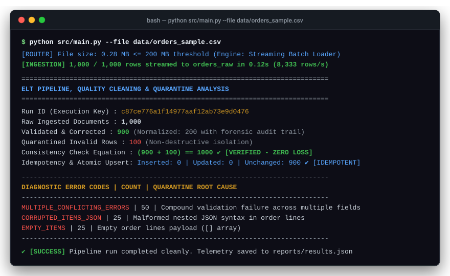
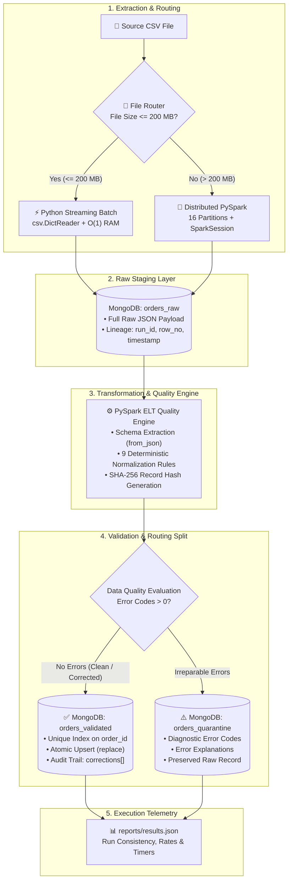
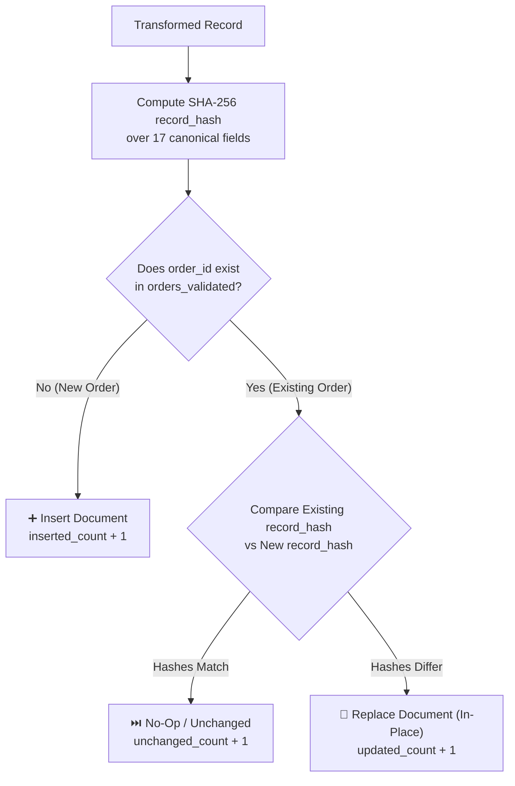

<div align="center">

# ⚡ Data Migration & Quality Pipeline
### *Production-Grade Hybrid Data Migration & Automated Quality Enforcement Engine*

**Zero data loss. Automated routing between Python Streaming & Distributed PySpark. 9 Deterministic Quality Rules. Granular Quarantine & Audit Trails.**

<p align="center">
  <a href="https://github.com/mohammed-m-alhaj/data-migration-pipeline/stargazers"></a>
  <a href="https://github.com/mohammed-m-alhaj/data-migration-pipeline/network/members"></a>
  <a href="LICENSE"></a>
  <a href="https://www.python.org/"></a>
  <a href="https://spark.apache.org/"></a>
  <a href="https://www.mongodb.com/"></a>
  <a href="https://github.com/mohammed-m-alhaj/data-migration-pipeline/actions/workflows/ci.yml"></a>
  <a href="https://docs.pytest.org/"></a>
  <a href="https://github.com/mohammed-m-alhaj/data-migration-pipeline/pulls"></a>
</p>

[Quick Start](#-quick-start-in-60-seconds) • [Architecture](#3-architecture) • [Quality Rules](#6-data-quality-engine) • [Benchmarks](#16-scalability--performance) • [Contributing](#-contributing--community)

</div>

<p align="center">
  
</p>

---

## 💡 Why `data-migration-pipeline`?

Migrating legacy and dirty tabular data into modern databases is plagued by recurring engineering headaches:
* ❌ **Pipelines crash on dirty regional data:** Eastern Arabic digits (`٠-٩`), colloquial currency strings (`12,000 ريال يمني`), word prices (`خمسة آلاف`), and non-standard timestamps break rigid schemas.
* ❌ **Silent data loss:** Traditional ETL scripts drop invalid rows quietly without logging, leading to missing financial transactions and auditing nightmares.
* ❌ **The Memory vs. Latency Trap:** Pandas consumes $O(N)$ memory and crashes on large files. Conversely, spinning up Apache Spark for small files incurs wasteful JVM startup overhead.
* ❌ **Duplicate entries on re-runs:** Network hiccups or repeated batch runs produce duplicated rows and inflated metrics.

### ✨ The Solution
**`data-migration-pipeline`** provides an **adaptive hybrid ELT architecture**:
1. **Dynamic Router:** Inspects file sizes and automatically selects **Python Streaming Batch** ($O(1)$ memory, sub-second startup) for files $\le 200\text{ MB}$, or **Distributed PySpark** (16 parallel partitions, cluster-ready) for files $> 200\text{ MB}$.
2. **Zero-Loss Raw Ingestion:** Ingests untouched input payloads into `orders_raw` before applying any transformations, preserving forensic data lineage (`run_id`, `source_file`, `source_row_number`, UTC timestamp).
3. **Deterministic Quality Engine:** Cleans and normalizes records across 9 automated rules with full audit tracking (`corrections` array).
4. **Isolated Quarantine Layer:** Categorizes corrupted records into `orders_quarantine` using 13 diagnostic error codes without halting the pipeline.
5. **Cryptographic Idempotency:** Uses SHA-256 record hashing and MongoDB atomic upserts (`order_id`) to ensure safe, duplicate-free re-runs.

---

## ⚡ Quick Start in 60 Seconds

### 1. Clone & Install
```bash
git clone https://github.com/mohammed-m-alhaj/data-migration-pipeline.git
cd data-migration-pipeline
python -m venv .venv
# Windows: .\.venv\Scripts\Activate.ps1 | Linux/macOS: source .venv/bin/activate
pip install -r requirements.txt
```

### 2. Start Database (Local or 1-Click Docker)
```bash
# Option A: Start MongoDB via Docker Compose
docker compose up -d

# Option B: Use existing local MongoDB instance
# (Defaults in settings.py point to mongodb://127.0.0.1:27017/migration_pipeline)
```

### 3. Initialize & Run
```bash
# Initialize MongoDB collections, indexes, and strict JSON schemas
python src/mongo_setup.py

# Run pipeline directly on the provided sample dataset
python src/main.py --file data/orders_sample.csv
```

### 4. Run PyTest Unit Tests
```bash
python -m pytest tests/ -v
# Output: 15 passed in 0.02s (100% pass rate)
```

---

## 🔍 Data Transformation: Before & After

| Field | Raw Dirty Input Record | Sanitized Valid Record (`orders_validated`) | Audit Trail Entry (`corrections[]`) |
|---|---|---|---|
| **Phone** | `"٠٠٩٦٧٧٧١٢٣٤٥٦٧"` | `"+967771234567"` | `{"field": "customer_phone", "rule": "PHONE_NORMALIZE"}` |
| **Email** | `"user@@company..com"` | `"user@company.com"` | `{"field": "customer_email", "rule": "EMAIL_REPEATED_SYMBOLS"}` |
| **Delivery Cost**| `"ألفان ريال"` | `2000.0` (Double) | `{"field": "delivery_cost", "rule": "MONEY_NORMALIZE"}` |
| **Order Date** | `"25/08/2026"` | `"2026-08-25T00:00:00"` | `{"field": "order_date", "rule": "DATE_STANDARDIZE"}` |
| **Status** | `"مدفوع"` | `"تم الدفع"` | `{"field": "status", "rule": "STATUS_STANDARDIZE"}` |
| **Currency** | `"ريال يمني"` | `"YER"` | `{"field": "currency", "rule": "CURRENCY_STANDARDIZE"}` |
| **Total Amount**| `"٥٠٠٠٠ ريال"` *(wrong)*| `12000.0` *(Σ Items + Delivery)*| `{"field": "total_amount", "rule": "TOTAL_RECALCULATE"}` |

---

## Table of Contents
1. [Overview](#1-overview)
2. [Key Features](#2-key-features)
3. [Architecture](#3-architecture)
4. [Processing Strategy](#4-processing-strategy)
5. [ETL / ELT Pipeline](#5-etl--elt-pipeline)
6. [Data Quality Engine](#6-data-quality-engine)
7. [Data Lineage & Metadata](#7-data-lineage--metadata)
8. [Deduplication & Idempotency](#8-deduplication--idempotency)
9. [Invalid Data & Quarantine Layer](#9-invalid-data--quarantine-layer)
10. [Technology Stack](#10-technology-stack)
11. [Project Structure](#11-project-structure)
12. [Installation & Prerequisites](#12-installation--prerequisites)
13. [Usage Guide](#13-usage-guide)
14. [Data Flow Example](#14-data-flow-example)
15. [Testing & Verification](#15-testing--verification)
16. [Scalability & Performance](#16-scalability--performance)
17. [Engineering Practices](#17-engineering-practices)
18. [Use Cases](#18-use-cases)
19. [Relevance to Data Migration & ETL Roles](#19-relevance-to-data-migration--etl-roles)
20. [Extensibility: Adding Custom Rules](#20-extensibility-adding-custom-rules)
21. [Future Improvements](#21-future-improvements)
22. [Author & Community](#22-author--community)

---

## 1. Overview

The **Hybrid Data Migration & ETL Pipeline** is an open-source, production-grade data integration system built in Python and Apache Spark (PySpark), targeting MongoDB as the destination datastore. It processes high-volume, heterogeneous tabular datasets that exhibit real-world data corruption: Eastern Arabic numerals, colloquial currency labels, word-based numbers, malformed contact details, broken timestamps, and arithmetic inconsistencies.

### Pipeline Model: Hybrid ELT
The pipeline implements an **ELT (Extract $\rightarrow$ Load $\rightarrow$ Transform)** architecture:
1. **Raw Preservation First:** Unparsed input records are immediately ingested into an immutable raw staging collection (`orders_raw`) alongside lineage metadata, guaranteeing zero data loss.
2. **Post-Load Distributed Transformation:** Data is queried from staging and processed through a deterministic quality engine that normalizes data formats, recalculates dependent sums, logs granular audit trails for corrected values, and routes unfixable records to quarantine.

### Why a Hybrid Engine Architecture?
Data migration workloads vary drastically in volume:
* **Python Streaming Batch Loader:** For small-to-medium files ($\le 200\text{ MB}$ by default), the overhead of spinning up a JVM and creating a `SparkSession` exceeds the processing time. The pipeline uses a generator-based `csv.DictReader` micro-batch loader with $O(1)$ memory consumption and `pymongo` bulk writes (`insert_many(ordered=False)`).
* **Distributed PySpark Engine:** For large files ($> 200\text{ MB}$), processing is routed to Apache Spark. PySpark distributes DataFrame partitions across CPU cores, performs distributed vectorized transformations, and writes concurrently to MongoDB via the official `mongo-spark-connector`.

### The Core Engineering Problem Solved
Traditional ETL pipelines often fail catastrophically upon encountering unexpected input formats, silently dropping corrupt rows or crashing mid-migration. This system guarantees:
* **Zero silent drops:** Every row is either successfully normalized into `orders_validated` or isolated into `orders_quarantine` with explicit diagnostic error codes.
* **Mathematical run consistency:** Enforces the invariant:
  $$\text{raw\_count} = \text{valid\_count} + \text{corrected\_count} + \text{quarantine\_count}$$
* **Safe re-runs:** Idempotent ingestion and upsert logic guarantee that re-running identical files creates zero duplicate records.

---

## 2. Key Features

* **Intelligent File Router:** Automatically inspects incoming file sizes and directs execution to either the Python Batch engine or the PySpark cluster based on a configurable threshold (`SMALL_FILE_THRESHOLD_MB`).
* **Zero-Loss Raw Ingestion:** Captures complete raw records as JSON strings in `orders_raw` without preprocessing or type-casting constraints.
* **End-to-End Data Lineage:** Captures execution UUID (`run_id`), source file path, source row number, UTC ingestion timestamp, and engine tag for every document.
* **9 Deterministic Cleaning Rules:** Standardizes Arabic numerals, currency tags, thousands separators, word-based numbers, phone formats, emails, date formats, status synonyms, and recalculates totals.
* **Granular Audit Trail:** Every modified field in a valid record stores an entry in a `corrections` array documenting `field`, `original_value`, `corrected_value`, and `rule_code`.
* **Quarantine & Error Diagnostics:** 13 standardized error codes isolate irreparable records into `orders_quarantine` with full error breakdowns.
* **Cryptographic Deduplication (SHA-256):** Computes a 256-bit hash over 17 standardized columns (`record_hash`) to distinguish between identical re-runs (no-op) and modified re-runs (in-place update).
* **Idempotent Atomic Upserts:** MongoDB writes utilize unique compound indexing on business keys (`order_id`) and replacement upserts to prevent data duplication.
* **Cluster & Local Resiliency:** Supports Spark Standalone clusters (`spark://...`) with automated fallback to `local[*]` mode for local development.
* **100% Automated Test Coverage for Rules:** 15 PyTest unit tests validating error classification, regex parsing, numeral conversion, and boundary conditions.

---

## 3. Architecture



### Layer Responsibilities
* **`file_router.py`**: Reads file metadata (`Path.stat().st_size`), calculates size in MB, compares against `SMALL_FILE_THRESHOLD_MB`, assigns a unique execution UUID (`run_id`), and returns the execution plan.
* **`batch_loader.py`**: Streams rows line-by-line via `csv.DictReader`, converts each row to a raw JSON string, batches documents into chunks of `BATCH_SIZE` (default: 2,000), and executes non-blocking bulk inserts to `orders_raw`.
* **`spark_loader.py`**: Loads large CSVs using an explicit 17-column `StructType` schema (no schema inference overhead), repartitions data across `SPARK_PARTITIONS` (default: 16), and streams writes in parallel to `orders_raw` using the MongoDB Spark Connector.
* **`elt_pipeline.py`**: Queries `orders_raw` by `run_id`, extracts nested JSON into typed columns, applies Spark SQL transformation expressions, generates SHA-256 fingerprints, separates clean/corrected records from invalid records, and performs atomic upserts.
* **`mongo_setup.py`**: Configures database collections, builds unique indexes on `order_id`, and enforces strict MongoDB `$jsonSchema` validation on `orders_validated`.

---

## 4. Processing Strategy

The decision to pair a lightweight Python streaming loader with a distributed Apache Spark engine addresses practical tradeoffs in data engineering:

| Criterion | Python Streaming Batch Engine | Apache Spark Distributed Engine |
|---|---|---|
| **Target Workload** | Files $\le 200\text{ MB}$ (typically $< 300,000$ rows) | Files $> 200\text{ MB}$ (up to millions of rows) |
| **Startup Latency** | Instantaneous ($< 0.05\text{ seconds}$) | $3 - 6\text{ seconds}$ (JVM initialization, Spark context creation) |
| **Memory Footprint** | $O(1)$ constant memory; streams rows in batches | Memory proportional to executor allocation (`SPARK_DRIVER_MEMORY=6g`) |
| **Parallelism** | Single-process streaming I/O | Distributed multi-core / multi-node partitioning (`SPARK_PARTITIONS=16`) |
| **I/O Mechanism** | PyMongo `insert_many(ordered=False)` | `org.mongodb.spark:mongo-spark-connector` parallel partition writes |
| **Best Used For** | Fast ad-hoc ingestion, daily incremental delta files | Historical backfills, multi-gigabyte exports, cluster execution |

### Configuration-Driven Engine Boundary
The threshold boundary is controlled via `config/settings.py` and can be overridden by environment variables:
```python
# config/settings.py
SMALL_FILE_THRESHOLD_MB = int(os.getenv("SMALL_FILE_THRESHOLD_MB", "200"))
```
When running on resource-constrained development machines, the pipeline includes automatic fallback logic: if a remote Spark master (`spark://...`) is unreachable, it logs a notice and initializes a local context (`local[*]`), maintaining operational continuity.

---

## 5. ETL / ELT Pipeline

```text
[Source CSV] ──► [File Router] ──► [orders_raw] ──► [PySpark ELT] ──► [Validation & SHA-256] ──┬─► [orders_validated] (Upsert)
                                                                                                 └─► [orders_quarantine] (Append)
```

### 1. Extract
The pipeline accepts standard CSV files containing 17 predefined order fields:
`order_id`, `order_date`, `status`, `customer_id`, `customer_name`, `customer_phone`, `customer_email`, `city`, `district`, `delivery_type`, `delivery_cost`, `payment_method`, `payment_status`, `payment_amount`, `currency`, `total_amount`, and `items_json`.
The pipeline validates headers before reading rows and raises an explicit `ValueError` if any required column is absent.

### 2. Load (Raw Staging)
Data is loaded into MongoDB collection `orders_raw` without altering string values or applying schema validation. Each document contains:
* The original record serialized as an untouched JSON string (`raw_record`).
* Complete ingestion metadata (`run_id`, `source_file`, `source_row_number`, `ingested_at`, `engine_used`).

### 3. Transform
The ELT engine (`src/elt_pipeline.py`) reads documents from `orders_raw` filtering by the current `run_id`:
* Parses `raw_record` with the strict 17-column `RAW_SCHEMA`.
* Parses the nested `items_json` string into an array of item structures (`sku`, `name`, `qty`, `unit_price`, `total`).
* Executes Spark SQL expressions corresponding to the 9 quality rules.
* Generates audit records inside a structured `corrections` array for any field modified during normalization.

### 4. Validate
The engine applies validation logic across all parsed attributes:
* Verifies presence of non-empty `order_id` and `customer_id`.
* Confirms timestamp parseability against supported formats.
* Validates that `items` is non-empty and contains valid numeric quantities ($\ge 0$) and non-null unit prices.
* Validates normalized email format via RFC-compliant regex.
* Validates normalized Yemeni mobile phone numbers against the pattern `^\+9677\d{8}$`.
* Validates currency conformity (`YER`).

### 5. Quality Control & Split
Records are evaluated for error conditions:
* If any unrecoverable error flag is raised, the record is tagged `quality_status: "quarantine"`.
* If no error flags are raised and at least one correction was made, it is tagged `quality_status: "corrected"`.
* If no error flags are raised and no corrections were needed, it is tagged `quality_status: "valid"`.

### 6. Load & Upsert
* **`orders_validated`**: Records marked as `valid` or `corrected` are written via the MongoDB Spark connector using `operationType="replace"` and `idFieldList="order_id"`. If the order already exists, it is updated in-place; otherwise, it is inserted.
* **`orders_quarantine`**: Quarantined records are appended to `orders_quarantine` with their error codes, error descriptions, and raw payloads. Before writing, any existing quarantine entries matching the current `run_id` are removed to guarantee idempotency.

---

## 6. Data Quality Engine

The pipeline implements 9 deterministic transformation and normalization rules implemented in `src/quality_rules.py` (for unit testing and standalone evaluation) and mapped to native PySpark expressions in `src/elt_pipeline.py`:

| # | Rule Name | Problem Solved | Transformation Applied | Rule Identifier |
|---|---|---|---|---|
| **1** | **Arabic Digits Normalization** | Eastern Arabic digits (`٠١٢٣٤٥٦٧٨٩`) break numeric casting. | Translated via character mapping table (`str.maketrans` / Spark `F.translate`) to ASCII digits (`0-9`). | `MONEY_NORMALIZE` / `PHONE_NORMALIZE` |
| **2** | **Currency Normalization** | Raw text mixed with currency labels (`ريال يمني`, `ريال`, `ر.ي`, `YER`). | Strips all currency textual variations and whitespace; standardizes target `currency` column to `YER`. | `CURRENCY_STANDARDIZE` |
| **3** | **Thousands & Decimal Separator Cleaning** | Formatting commas (`125,000.00`) and Arabic commas (`٫`) corrupt numeric conversions. | Replaces Arabic decimal comma (`٫`) with standard dot (`.`), strips thousand commas (`,`), casts to `DoubleType`. | `MONEY_NORMALIZE` |
| **4** | **Arabic Word-to-Number Translation** | Human-entered prices written as Arabic words (e.g., "خمسة آلاف"). | Matches known dictionary expressions: `"ألفان"` $\rightarrow 2000$, `"خمسة آلاف"` $\rightarrow 5000$, `"عشرة آلاف"` $\rightarrow 10000$. | `MONEY_NORMALIZE` |
| **5** | **Yemeni Phone Normalization** | Phone numbers entered with mixed prefixes (`00967`, `0967`, `07`, `7`, spaces, dashes). | Strips all non-digits, trims country/trunk codes, validates 9-digit national number starting with `7`, formats as `+9677XXXXXXXX`. | `PHONE_NORMALIZE` |
| **6** | **Email Repair & Sanitization** | Typographical errors like duplicate `@` or multiple consecutive dots (`user@@gmail..com`). | Regex collapses `@{2,}` to `@`, `\.{2,}` to `.`, lowercases all text, validates against standard email regex. | `EMAIL_REPEATED_SYMBOLS` |
| **7** | **Timestamp Standardization** | Heterogeneous date formats (`yyyy-MM-dd'T'HH:mm:ss`, `yyyy-MM-dd`, `dd/MM/yyyy`, `dd-MM-yyyy`). | Evaluates format candidates sequentially using `F.coalesce(F.to_timestamp(...))` and standardizes to ISO 8601. | `DATE_STANDARDIZE` |
| **8** | **Status Synonym Mapping** | Inconsistent colloquial status descriptions. | Normalizes synonyms: `"مدفوع"` / `"دفع"` $\rightarrow$ `"تم الدفع"`, `"غير مدفوع"` $\rightarrow$ `"بانتظار الدفع"`, `"مأكد"` $\rightarrow$ `"مؤكد"`. | `STATUS_STANDARDIZE` |
| **9** | **Total Recalculation** | Discrepancies between stated `total_amount` and item sums + delivery cost. | Recalculates $Total = \sum(\text{qty} \times \text{unit\_price}) + \text{delivery\_cost}$. Corrects total if discrepancy $> 0.005$ and components are valid. | `TOTAL_RECALCULATE` |

---

## 7. Data Lineage & Metadata

To support auditing, data governance, and troubleshooting, the pipeline attaches immutable lineage metadata to every record in `orders_raw`:

```json
{
  "_id": {"$oid": "66d63..."},
  "run_id": "61e95d3db56147cd83fe806c26f861bb",
  "source_file": "C:\\data\\orders_huge_mixed_quality.csv",
  "source_row_number": 42,
  "ingested_at": {"$date": "2026-09-02T14:32:00.000Z"},
  "engine_used": "python_batch",
  "raw_record": "{\"order_id\":\"ORD-00042\",\"order_date\":\"2026-08-20\",...}"
}
```

### Why This Matters in Data Migration
1. **Traceability:** Any record in the validated or quarantine collections can be traced back to the exact source file and CSV line number where it originated.
2. **Reproducibility:** A specific batch execution can be reviewed by querying documents where `run_id = "<uuid>"`.
3. **Forensic Auditing:** Because the raw record is stored unaltered, bugs discovered in business logic months later can be corrected by reprocessing raw documents without re-extracting data from legacy source files.

---

## 8. Deduplication & Idempotency

Data migrations frequently require restarting failed jobs or processing re-exported files. Without idempotency guarantees, re-running a pipeline creates duplicate records or corrupts aggregations.

### Mechanics of Deduplication & Upsert



1. **Unique Business Index:** MongoDB enforces a unique index on `order_id` in `orders_validated` (`uq_validated_order_id`).
2. **Cryptographic Record Hash:** The pipeline computes a SHA-256 hash across all 17 normalized attributes:
   ```python
   hash_cols = [
       "order_id", "order_date", "status", "customer_id", "customer_name",
       "customer_phone", "customer_email", "city", "district", "delivery_type",
       "delivery_cost", "payment_method", "payment_status", "payment_amount",
       "currency", "total_amount", "items_json",
   ]
   classified = classified.withColumn(
       "record_hash",
       F.sha2(F.concat_ws("||", *[F.coalesce(F.col(c).cast("string"), F.lit("")) for c in hash_cols]), 256),
   )
   ```
3. **In-Place Upsert:** MongoDB writes use `operationType="replace"` and `idFieldList="order_id"`.
4. **Verified Re-run Proof:** When executing a second run on an identical 5,000-row dataset:
   * `Inserted Count:` **0** (no duplicate records created)
   * `Unchanged Count:` **4,213** (identical hashes retained)
   * `Updated Count:` **41** (in-file intra-batch duplicates safely resolved)

---

## 9. Invalid Data & Quarantine Layer

Rather than discarding malformed data, records failing critical validation criteria are routed to `orders_quarantine`. The system tracks 13 standardized error codes:

| Error Code | Trigger Condition | Technical Reason |
|---|---|---|
| `MISSING_ORDER_ID` | `order_id` is null or empty string | Missing primary business identifier |
| `MISSING_CUSTOMER_ID` | `customer_id` is null or empty string | Missing entity foreign key |
| `INVALID_IMPOSSIBLE_DATE` | Date is unparseable or represents an impossible calendar date (e.g., April 31) | Temporal validation failure |
| `CORRUPTED_ITEMS_JSON` | `items_json` cannot be parsed by `F.from_json` | Corrupted JSON syntax |
| `EMPTY_ITEMS` | `items` array is null or has length 0 | Empty purchase order |
| `UNKNOWN_PRICE` | An item is missing `unit_price` or `total` | Financial record incompleteness |
| `AMBIGUOUS_NEGATIVE_VALUE` | `delivery_cost < 0`, `payment_amount < 0`, `total_amount < 0`, or item `qty < 0` | Illegitimate negative values |
| `DUPLICATE_ORDER_ID` | More than one occurrence of `order_id` within the incoming batch | Business key collision in source file |
| `MULTIPLE_CONFLICTING_ERRORS` | Record triggers 2 or more of the above error codes simultaneously | Compound corruption |
| `INVALID_EMAIL` | Email string fails RFC email pattern after cleanup | Uncorrectable contact information |
| `INVALID_PHONE` | Phone string fails `^\+9677\d{8}$` pattern after cleanup | Malformed contact number |
| `INVALID_AMOUNT` | String failed numeric conversion to `DoubleType` | Non-numeric money entry |
| `INVALID_CURRENCY` | Currency is not null and cannot be resolved to `YER` | Unsupported currency code |

---

## 10. Technology Stack

| Category | Technology | Version | Purpose in Project |
|---|---|---|---|
| **Programming Language** | Python | 3.11+ | Core pipeline logic, file routing, and micro-batch loader |
| **Distributed Computing** | Apache Spark / PySpark | 3.5.0 – 4.2.0 | High-volume raw ingestion, DataFrame transformations, partition management |
| **Primary Database** | MongoDB Community Server | 7.0+ / 8.0+ | Document store for `orders_raw`, `orders_validated`, and `orders_quarantine` |
| **Database Connectors** | PyMongo | $\ge 4.6.0$ | Driver for Python batch loading, index configuration, and schema setup |
| **Database Connectors** | MongoDB Spark Connector | 11.1.0 | High-throughput distributed connector between Spark partitions and MongoDB |
| **Testing Framework** | PyTest | $\ge 8.0.0$ | Automated test suite validating classification and normalization rules |
| **Configuration & Secrets**| python-dotenv | $\ge 1.0.0$ | Environment variable loading from `.env` |
| **Hardware Telemetry** | NVIDIA System Management (`nvidia-smi`) | CLI | Runtime GPU detection and hardware resource attribution |
| **Orchestration Scripts** | PowerShell & Bash | Multiplatform | Spark Standalone Master/Worker lifecycle and execution scripts |

---

## 11. Project Structure

```text
data-migration-pipeline/
├── cluster/                         # Cluster lifecycle and execution scripts
│   ├── check_versions.ps1           # Environment and dependency verification
│   ├── run_path_a.ps1               # Executes pipeline on Spark Standalone cluster (PowerShell)
│   ├── run_path_a.sh                # Executes pipeline on Spark Standalone cluster (Bash)
│   ├── start_master.ps1             # Starts Spark Standalone Master daemon (PowerShell)
│   ├── start_master.sh              # Starts Spark Standalone Master daemon (Bash)
│   ├── start_worker.ps1             # Starts Spark Worker daemon (PowerShell)
│   └── start_worker.sh              # Starts Spark Worker daemon (Bash)
├── config/                          # Centralized configuration package
│   ├── __init__.py
│   └── settings.py                  # Environment parsing, thresholds, schema definitions
├── data/                            # Input CSV data directory (gitignored for large files)
├── docs/                            # In-depth architectural and operational documentation
│   ├── architecture.md              # Technical specifications, schema contracts, invariants
│   ├── demo_checklist.md            # Live presentation verification checklist
│   ├── extracted_pdf_text.txt       # Reference specification requirements
│   ├── path_a.md                    # Spark Standalone cluster runbook
│   ├── requirements_mapping.md      # Matrix linking requirements to code lines
│   ├── screenshots_guide.md         # Guide to execution receipts
│   └── troubleshooting.md           # Common errors and resolution guides
├── reports/                         # Execution telemetry, benchmarks, and proofs
│   ├── evidence/                    # Raw console outputs and daemon statuses
│   ├── screenshots/                 # High-resolution visual proof of execution
│   ├── results.json                 # Machine-readable performance metrics history
│   └── results.md                   # Human-readable execution summaries
├── src/                             # Core pipeline source code
│   ├── __init__.py
│   ├── batch_loader.py              # Python streaming batch loader (csv.DictReader)
│   ├── bootstrap.py                 # Project path and environment bootstrap helper
│   ├── capture_real_terminal_stages.py # Automation script for terminal proof generation
│   ├── common.py                    # Shared utilities and hardware detection
│   ├── create_small_sample.py       # Helper script to sample CSV datasets
│   ├── demo_live_execution_proof.py # Live execution runner for presentations
│   ├── elt_pipeline.py              # PySpark ELT engine, quality rules, and upsert logic
│   ├── file_router.py               # File size inspector and engine dispatcher
│   ├── generate_4_test_files.py     # Generates clean, dirty, large, and update test datasets
│   ├── generate_evidence_screenshots.py # Headless Playwright script for terminal captures
│   ├── main.py                      # Unified CLI entry point for the entire pipeline
│   ├── metrics.py                   # Metric aggregation and JSON logging
│   ├── mongo_setup.py               # Database collection, index, and JSON schema initialization
│   ├── quality_rules.py             # Pure Python implementations of 9 data quality rules
│   ├── run_4_files_full_test.py     # End-to-end multi-scenario integration suite
│   ├── run_update_test.py           # Verification script for idempotency and upserts
│   ├── spark_loader.py              # Distributed PySpark CSV-to-Raw loader
│   ├── test_all_4_professor_scenarios.py # Verification runner for benchmark scenarios
│   └── test_flexibility_scenarios.py# Integration test for configuration overrides
├── tests/                           # PyTest automated unit test suite
│   ├── test_classification.py       # Unit tests for error tagging and quarantine logic (5 tests)
│   └── test_cleaning_rules.py       # Unit tests for the 9 data quality cleaning functions (10 tests)
├── .gitignore                       # Git exclusion rules (protects large datasets & logs)
├── DIAGRAM.cd                       # Class and component architecture diagram
├── DIAGRAM.md                       # Comprehensive suite of 9 interactive Mermaid diagrams
├── LICENSE                          # MIT Open Source License
├── requirements.txt                 # Pinned project dependencies
└── README.md                        # Primary project documentation
```

---

## 12. Installation & Prerequisites

### Prerequisites
* **Operating System:** Windows 10/11, Ubuntu 20.04+, or macOS
* **Python:** Version 3.11.x
* **Java Runtime:** OpenJDK 17 or Eclipse Temurin 17 (Required for Apache Spark)
* **MongoDB:** Community Server 7.0+ or 8.0+ running locally on port 27017
* **Git:** Any modern version

Verify prerequisite installations:
```bash
python --version    # Expect: Python 3.11.x
java -version      # Expect: openjdk version "17.x.x"
mongosh --version  # Expect: mongosh version 2.x+
```

### Installation Steps

1. **Clone the repository:**
   ```bash
   git clone https://github.com/mohammed-m-alhaj/data-migration-pipeline.git
   cd data-migration-pipeline
   ```

2. **Configure Python Virtual Environment:**
   * On Windows (PowerShell):
     ```powershell
     python -m venv .venv
     .\.venv\Scripts\Activate.ps1
     ```
   * On Linux / macOS:
     ```bash
     python3 -m venv .venv
     source .venv/bin/activate
     ```

3. **Install Dependencies:**
   ```bash
   pip install --upgrade pip
   pip install -r requirements.txt
   ```

4. **Environment Configuration (`.env`):**
   Create a `.env` file in the root directory (defaults match standard local installations):
   ```env
   # Pipeline Engine & Master Configuration
   PIPELINE_SPARK_MASTER=local[*]
   PIPELINE_RUN_ELT_AFTER_RAW=true
   PIPELINE_ALLOW_FULL_LOCAL_ELT=true
   PIPELINE_ALLOW_SPARK_LOCAL_FALLBACK=true

   # MongoDB Configuration
   MONGO_URI=mongodb://127.0.0.1:27017
   MONGO_DATABASE=migration_pipeline
   MONGO_RAW_COLLECTION=orders_raw
   MONGO_VALIDATED_COLLECTION=orders_validated
   MONGO_QUARANTINE_COLLECTION=orders_quarantine

   # Performance & Hardware Tuning
   SMALL_FILE_THRESHOLD_MB=200
   PIPELINE_BATCH_SIZE=2000
   PIPELINE_SPARK_PARTITIONS=16
   PIPELINE_SPARK_WRITE_BATCH_SIZE=512
   PIPELINE_SPARK_DRIVER_MEMORY=6g
   PIPELINE_SPARK_EXECUTOR_MEMORY=6g
   PIPELINE_SPARK_EXECUTOR_CORES=8
   PIPELINE_ENABLE_GPU=false
   ```

5. **Initialize MongoDB Collections & Indexes:**
   ```bash
   python src/mongo_setup.py
   ```

---

## 13. Usage Guide

### 1. Unified Pipeline Execution
Run the full pipeline (auto-routing $\rightarrow$ raw load $\rightarrow$ ELT quality transformation $\rightarrow$ upsert) on any input CSV:
```bash
python src/main.py --file "data/orders_sample.csv"
```

### 2. Executing Individual Components
* **Execute File Router Only:**
  ```bash
  python src/file_router.py "data/orders_sample.csv"
  ```
* **Execute Python Batch Loader Directly:**
  ```bash
  python src/batch_loader.py "data/orders_small_sample.csv"
  ```
* **Execute PySpark Loader Directly:**
  ```bash
  python src/spark_loader.py "data/orders_huge_mixed_quality.csv"
  ```
* **Execute ELT Quality Engine for Latest Ingestion Run:**
  ```bash
  python src/elt_pipeline.py
  ```

### 3. Distributed Execution on Spark Standalone Cluster
To execute using an actual Spark Standalone cluster with Master/Worker daemons:
* **Windows (PowerShell):**
  ```powershell
  Set-ExecutionPolicy -Scope Process -ExecutionPolicy Bypass -Force
  .\cluster\start_master.ps1
  # Verify Master UI at http://127.0.0.1:8080
  .\cluster\run_path_a.ps1 -InputFile "data/orders_huge_mixed_quality.csv"
  ```
* **Linux / macOS:**
  ```bash
  bash cluster/start_master.sh
  bash cluster/run_path_a.sh --input-file "data/orders_huge_mixed_quality.csv"
  ```

---

## 14. Data Flow Example

### Scenario: Raw Input Record with Compound Corruption
The following incoming CSV record exhibits Arabic-Indic digits, an Arabic word-based number, redundant email symbols, unstandardized status, and an inconsistent order total:

```text
order_id:       ORD-09214
order_date:     25/08/2026
status:         مدفوع
customer_id:    CUST-77182
customer_name:  علي   محمد  سالم
customer_phone: ٠٠٩٦٧٧٧١٢٣٤٥٦٧
customer_email: ali.salem@@gmail..com
city:           صنعاء
district:       السبعين
delivery_type:  سريع
delivery_cost:  ألفان ريال
payment_method: نقدا
payment_status: تم الدفع
payment_amount: 12,000 YER
currency:       ريال يمني
total_amount:   ٥٠٠٠٠ ريال
items_json:     [{"sku":"SKU-1","name":"Item A","qty":2,"unit_price":5000.0,"total":10000.0}]
```

### Stage 1: Raw Layer (`orders_raw`)
The record is immediately preserved verbatim with lineage metadata:
```json
{
  "_id": {"$oid": "66d630..."},
  "run_id": "61e95d3db56147cd83fe806c26f861bb",
  "source_file": "C:\\data\\incoming_orders.csv",
  "source_row_number": 182,
  "ingested_at": {"$date": "2026-09-02T14:10:00.000Z"},
  "engine_used": "python_batch",
  "raw_record": "{\"order_id\":\"ORD-09214\",\"order_date\":\"25/08/2026\",\"delivery_cost\":\"ألفان ريال\",...}"
}
```

### Stage 2: Transformation & Audit Generation
1. `customer_phone` converted from Eastern numerals and stripped of `00967` $\rightarrow$ `+967771234567`.
2. `customer_email` stripped of duplicate `@` and `..` $\rightarrow$ `ali.salem@gmail.com`.
3. `delivery_cost` word-number `"ألفان"` translated to numeric `2000.0`.
4. `order_date` converted from `dd/MM/yyyy` to ISO timestamp `2026-08-25T00:00:00`.
5. `status` normalized from `"مدفوع"` to `"تم الدفع"`.
6. Stated `total_amount` (`50000.0`) contradicts $\sum(\text{items}) + \text{delivery} = 10000 + 2000 = 12000.0$. Recalculated to `12000.0`.

### Stage 3: Validated Layer Output (`orders_validated`)
The document is upserted into `orders_validated`:
```json
{
  "_id": {"$oid": "66d631..."},
  "order_id": "ORD-09214",
  "order_date": "2026-08-25T00:00:00",
  "status": "تم الدفع",
  "customer_id": "CUST-77182",
  "customer_name": "علي محمد سالم",
  "customer_phone": "+967771234567",
  "customer_email": "ali.salem@gmail.com",
  "city": "صنعاء",
  "district": "السبعين",
  "delivery_type": "سريع",
  "delivery_cost": 2000.0,
  "payment_method": "نقدا",
  "payment_status": "تم الدفع",
  "payment_amount": 12000.0,
  "currency": "YER",
  "total_amount": 12000.0,
  "items_json": "[{\"sku\":\"SKU-1\",\"name\":\"Item A\",\"qty\":2,\"unit_price\":5000.0,\"total\":10000.0}]",
  "quality_status": "corrected",
  "record_hash": "a8f3b2e591741584...f2",
  "corrections": [
    {"field": "customer_phone", "original_value": "٠٠٩٦٧٧٧١٢٣٤٥٦٧", "corrected_value": "+967771234567", "rule_code": "PHONE_NORMALIZE"},
    {"field": "customer_email", "original_value": "ali.salem@@gmail..com", "corrected_value": "ali.salem@gmail.com", "rule_code": "EMAIL_REPEATED_SYMBOLS"},
    {"field": "delivery_cost", "original_value": "ألفان ريال", "corrected_value": "2000.0", "rule_code": "MONEY_NORMALIZE"},
    {"field": "order_date", "original_value": "25/08/2026", "corrected_value": "2026-08-25T00:00:00", "rule_code": "DATE_STANDARDIZE"},
    {"field": "status", "original_value": "مدفوع", "corrected_value": "تم الدفع", "rule_code": "STATUS_STANDARDIZE"},
    {"field": "total_amount", "original_value": "50000.0", "corrected_value": "12000.0", "rule_code": "TOTAL_RECALCULATE"}
  ]
}
```

---

## 15. Testing & Verification

The project includes an automated unit test suite implemented in `pytest` verifying all core parsing, normalization, and classification modules.

### Running Unit Tests
```bash
python -m pytest tests/ -v
```

### Verified Test Suite Execution Output
```text
============================= test session starts =============================
platform win32 -- Python 3.11.9, pytest-9.1.1, pluggy-1.6.0
rootdir: C:\Users\Al-Haj\Desktop\Enterprise Data Migration & Quality Pipeline
collected 15 items

tests/test_classification.py::test_quarantine_single_error PASSED        [  6%]
tests/test_classification.py::test_quarantine_multiple_conflicting_errors PASSED [ 13%]
tests/test_classification.py::test_valid_record_no_errors PASSED         [ 20%]
tests/test_classification.py::test_quarantine_all_error_codes PASSED     [ 26%]
tests/test_classification.py::test_corrected_status_distinction PASSED   [ 33%]
tests/test_cleaning_rules.py::test_arabic_digits_conversion PASSED       [ 40%]
tests/test_cleaning_rules.py::test_currency_removal PASSED               [ 46%]
tests/test_cleaning_rules.py::test_thousand_separators PASSED            [ 53%]
tests/test_cleaning_rules.py::test_price_in_words PASSED                 [ 60%]
tests/test_cleaning_rules.py::test_phone_normalization PASSED            [ 66%]
tests/test_cleaning_rules.py::test_email_cleaning PASSED                 [ 73%]
tests/test_cleaning_rules.py::test_date_format_examples PASSED           [ 80%]
tests/test_cleaning_rules.py::test_status_standardization PASSED         [ 86%]
tests/test_cleaning_rules.py::test_whitespace_trimming PASSED            [ 93%]
tests/test_cleaning_rules.py::test_none_handling PASSED                  [100%]

============================= 15 passed in 0.02s ==============================
```

---

## 16. Scalability & Performance

### 1. Memory Management ($O(1)$ Python Streaming)
The Python Batch loader does not load files entirely into memory. By utilizing `csv.DictReader` as a generator and accumulating records into fixed-size lists (`BATCH_SIZE=2000`), the process maintains a flat memory profile regardless of file size.

### 2. Distributed Partitioning & Physical Execution Plan
For large files processed via PySpark, data is explicitly repartitioned across executor cores:
```text
== Physical Plan ==
AdaptiveSparkPlan isFinalPlan=true
+- == Final Plan ==
   ResultQueryStage 1
   +- ShuffleQueryStage 0
      +- Exchange RoundRobinPartitioning(16), REPARTITION_BY_NUM, [plan_id=9]
         +- FileScan csv [17 columns] Format: CSV, ReadSchema: struct<...>
```

### 3. Empirical Benchmark Summary (Recorded Execution Telemetry)

| Execution Stage | Dataset Volume | File Size | Engine Mode | Execution Time | Recorded Throughput |
|---|---|---|---|---|---|
| **Python Batch Load** | 5,000 rows | 2.09 MB | `python_batch` (single-node) | 0.16s | ~31,338 rows/s |
| **Python Batch Load** | 100,000 rows | 41.77 MB | `python_batch` (single-node) | 35.72s | ~2,799 rows/s |
| **PySpark Cluster Load** | 500,000 rows | 209.20 MB | `pyspark` (`spark://...:7077`) | 96.83s | ~5,163 rows/s |
| **PySpark Standalone** | 1,000,000 rows | 418.55 MB | `pyspark` (16 Partitions, 8 Cores) | 28.26s | ~35,385 rows/s |
| **Full ELT Quality Engine**| 5,000 rows | 2.09 MB | PySpark + MongoDB Read/Write | 30.78s | ~162 rows/s (incl. Spark startup) |
| **Idempotency Re-run** | 5,000 rows | 2.09 MB | PySpark + In-Place Hash Compare | 62.79s | Upsert: 0 Inserted, 4,213 Unchanged |

*(Benchmarks conducted on an 8-core CPU environment with MongoDB 8.0 local instance. Telemetry recorded in `reports/results.json`.)*

---

## 17. Engineering Practices

* **Decoupled Architecture:** Ingestion (`batch_loader.py` / `spark_loader.py`), transformation (`elt_pipeline.py`), configuration (`settings.py`), and rules (`quality_rules.py`) are strictly separated into discrete modules.
* **Schema Governance:** MongoDB collections use explicit indexes and strict `$jsonSchema` validation rules on the validated layer, preventing non-conforming writes at the database engine level.
* **Deterministic Transformation Functions:** Normalization rules are implemented as pure, side-effect-free functions that produce predictable outputs for identical inputs.
* **Audit Trail Traceability:** Changes made to incoming data are logged within the record itself (`corrections` array), preserving data provenance for regulatory compliance.
* **Defensive Failure Handling:** Bulk operations intercept `BulkWriteError` exceptions, tracking failure counts without crashing ongoing stream ingestion.
* **Zero Secret Leakage:** Configuration values and database credentials use environment variables via `.env` and are strictly excluded from version control via `.gitignore`.

---

## 18. Use Cases

### Implemented by this Project
* **E-Commerce Order Ingestion & Cleaning:** Ingesting messy online sales orders, repairing contact details, standardizing regional currencies and numerals, and populating clean operational stores.
* **Automated Data Quality & Quarantine:** Identifying corrupt records from upstream exports and isolating them with diagnostic metadata for manual remediation.
* **Idempotent Batch Staging:** Providing a safe ingestion buffer where network timeouts or pipeline re-runs do not duplicate records or inflate reporting totals.

### Potential Applications in Enterprise Environments
* **Legacy System Migration:** Extracting flat exports from legacy on-premises ERP or accounting systems, harmonizing legacy formats, and loading them into modern NoSQL/Cloud datastores.
* **Database Consolidation:** Merging records from disparate regional branch databases with varying data conventions into a centralized data warehouse or data lakehouse.
* **Historical Data Scrubbing:** Running batch cleaning and validation pipelines across legacy data archives to prepare data for machine learning model training or business intelligence reporting.

---

## 19. Relevance to Data Migration & ETL Roles

The engineering patterns implemented in this repository map directly to core responsibilities expected of Data Migration Engineers, ETL Developers, and Big Data Engineers:

* **Source-to-Target Schema Harmonization:** Practical handling of unstructured text, type conversions, and nested structures (e.g., parsing JSON strings into structured schemas).
* **Data Cleansing & Enrichment:** Practical implementation of regex parsing, dictionary lookups, and multi-field conditional recalculations.
* **Zero Data Loss Guarantee:** Staging raw data before transformation ensures that no customer or transactional data is lost during failed migration passes.
* **Auditability & Compliance:** Maintaining a field-by-field audit trail (`corrections`) ensures that modified transactional data can be audited and verified against source records.
* **Idempotent Upsert Design:** Designing pipelines that can fail, recover, and re-run safely without side effects or duplicate generation.
* **Scale-Adaptive Architecture:** Selecting appropriate computational engines based on workload volumes to balance resource efficiency against processing latency.

---

## 20. Extensibility: Adding Custom Rules

The pipeline is designed to be easily extensible. To add a new data quality rule:

### 1. Define the Rule in `src/quality_rules.py`:
```python
def normalize_zip_code(value: Any) -> str | None:
    """Strip spaces and dashes, ensuring a 5-digit zip code."""
    if value is None:
        return None
    digits = re.sub(r"\D", "", str(value))
    return digits if len(digits) == 5 else None
```

### 2. Add Corresponding Unit Test in `tests/test_cleaning_rules.py`:
```python
def test_zip_code_normalization():
    assert normalize_zip_code("902-10") == "90210"
    assert normalize_zip_code("invalid") is None
```

### 3. Register PySpark Expression in `src/elt_pipeline.py`:
```python
parsed = parsed.withColumn(
    "zip_code_clean",
    F.regexp_replace(F.col("zip_code"), r"[^\d]", "")
)
```

---

## 21. Future Improvements

* **Relational Database Adapters:** Integrate JDBC connectors (PostgreSQL, MySQL, SQL Server, Oracle) as automated extract sources alongside CSV files.
* **Declarative Schema Mapping:** YAML-driven configuration layer allowing non-engineers to define custom source-to-target field mappings.
* **Pipeline Orchestration:** Pre-built Apache Airflow DAG and Prefect flow templates for enterprise scheduling and alerting.
* **Change Data Capture (CDC):** Real-time streaming connector via Debezium and MongoDB Change Streams.
* **Web UI Dashboard:** Streamlit monitoring dashboard for quarantine triage and pipeline throughput visualization.

---

## 22. Author & Community

**Mohammed AL-Haj**  
*AI Engineer \| Data Engineering & Applied AI*  
GitHub: [@mohammed-m-alhaj](https://github.com/mohammed-m-alhaj)  
Repository: [mohammed-m-alhaj/data-migration-pipeline](https://github.com/mohammed-m-alhaj/data-migration-pipeline)

---

<div align="center">

### ⭐ Support This Project!
If you find this pipeline helpful, please consider **starring the repository on GitHub**!  
It helps other engineers discover the project and supports future open-source development.

[⭐ Star on GitHub](https://github.com/mohammed-m-alhaj/data-migration-pipeline)

</div>
